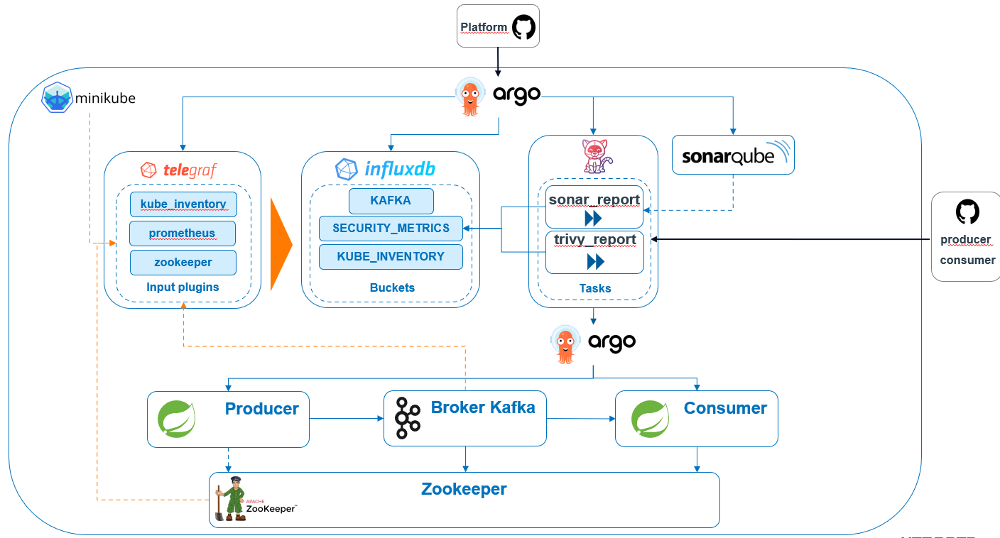
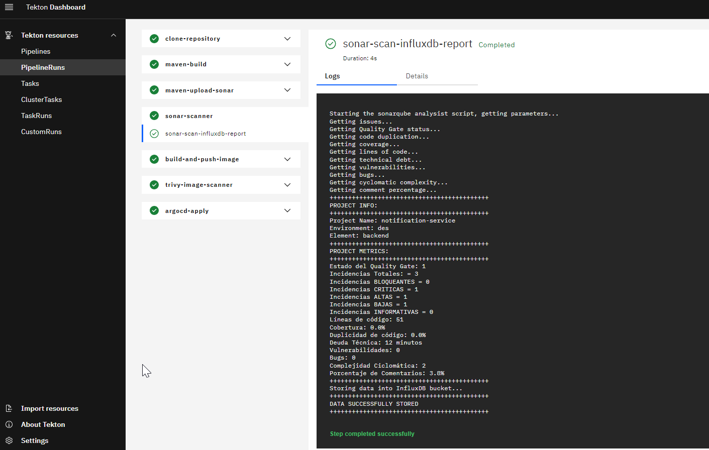
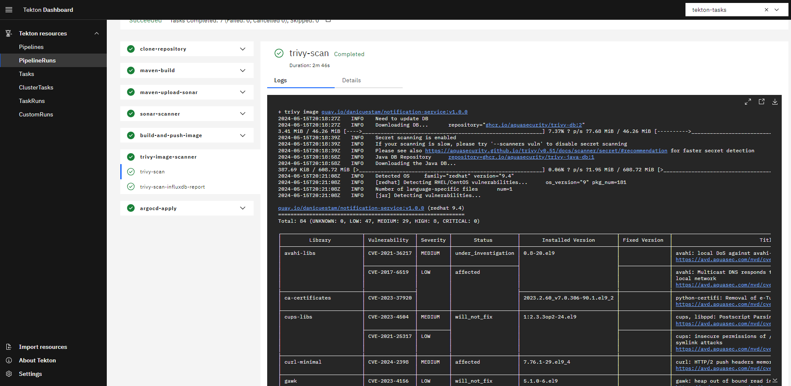
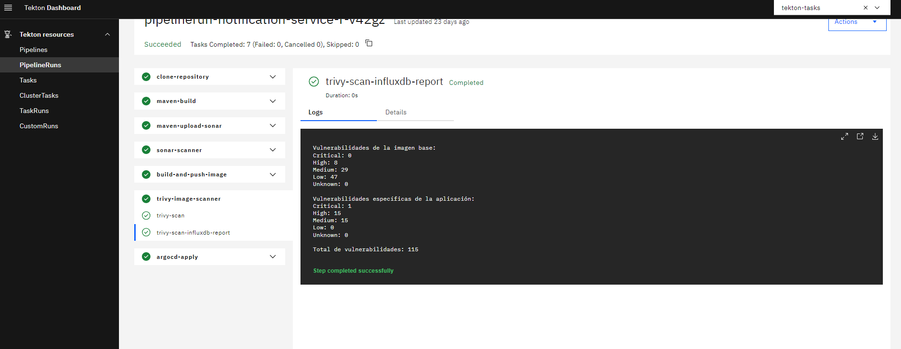
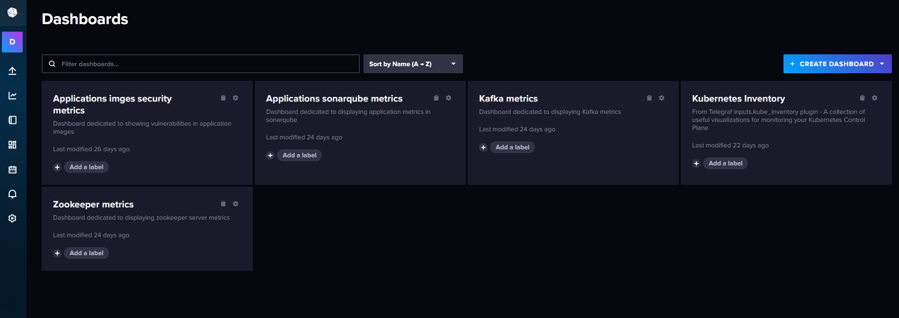
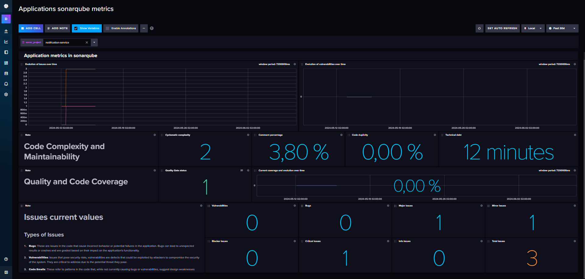
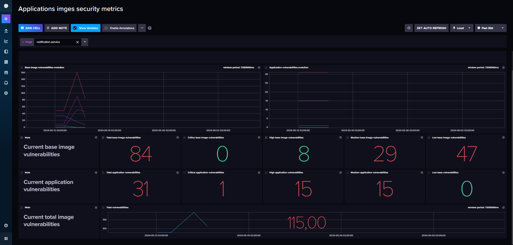
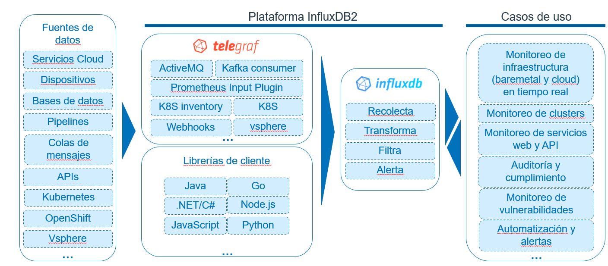

# Proyecto de Monitoreo y Análisis de Aplicaciones

## Descripción

Este proyecto implementa una arquitectura para la recolección, procesamiento y análisis de datos en un entorno de Kubernetes utilizando Minikube. Utiliza varias herramientas y tecnologías para garantizar la calidad del código y la seguridad de las aplicaciones durante su desarrollo e implementación. A continuación, se detalla cada componente y su función dentro del sistema.

## Componentes

### Minikube
Minikube proporciona el entorno de Kubernetes donde se despliegan y ejecutan los contenedores y servicios de la aplicación.

### Telegraf
Telegraf es un agente para la recolección de métricas y datos de rendimiento de sistemas. Utiliza los siguientes plugins de entrada:
- **kube_inventory**: Recolecta información sobre los recursos de Kubernetes.
- **prometheus**: Recolecta métricas de los endpoints de Prometheus.
- **zookeeper**: Recolecta métricas del servicio Zookeeper.

Estos datos son enviados a InfluxDB para su almacenamiento y posterior análisis.

### InfluxDB
InfluxDB es una base de datos de series temporales donde se almacenan las métricas y datos recolectados por Telegraf. Los datos se organizan en diferentes buckets:
- **KAFKA**: Almacena métricas relacionadas con Kafka.
- **SECURITY_METRICS**: Almacena métricas de seguridad.
- **KUBE_INVENTORY**: Almacena información de los recursos de Kubernetes.

### Tekton
Tekton es un framework de integración continua (CI) que gestiona el proceso de CI de las aplicaciones. Durante este proceso, Tekton genera reportes de calidad de código e imagen, los cuales son enviados a InfluxDB2 para monitorear su progresión en el tiempo.

### Argo
Argo es una herramienta de orquestación que se utiliza para automatizar el flujo de trabajo dentro del sistema. Se encarga de ejecutar tareas definidas y coordinar la comunicación entre los diferentes componentes.

### SonarQube
SonarQube es una plataforma de análisis de código estático que se utiliza para inspeccionar la calidad del código. Los reportes generados (`sonar_report` y `trivy_report`) se envían a SonarQube para su análisis detallado.

### Kafka
Kafka actúa como un broker de mensajes, facilitando la transmisión de datos entre productores y consumidores de manera eficiente y confiable.

### Producer y Consumer
- **Producer**: Genera datos y los envía a Kafka.
- **Consumer**: Consume los datos de Kafka y los procesa según sea necesario.

### Zookeeper
Zookeeper se utiliza para coordinar la configuración y el estado de los nodos de Kafka y otros servicios distribuidos.

### GitHub
GitHub se utiliza como plataforma para el código fuente.

## Flujo de Trabajo

1. **Recolección de Datos**: Telegraf recolecta métricas de `kube_inventory`, `prometheus` y `zookeeper`, y las envía a InfluxDB.
2. **Proceso de CI/CD**: Tekton maneja el CI de las aplicaciones, generando reportes de calidad de código e imagen que se envían a InfluxDB2.
3. **Análisis de Código e Imagen**: Los reportes de `sonar_report` y `trivy_report` son analizados por SonarQube y Trivy respectivamente.
4. **Orquestación**: Argo coordina la ejecución de tareas y el flujo de trabajo entre los componentes.
5. **Transmisión de Mensajes**: Kafka maneja la transmisión de datos entre los productores y consumidores.
6. **Monitoreo y Gestión**: Zookeeper coordina el estado de los nodos de Kafka.

## Resultados

A continuación, se presentan capturas de pantalla que ilustran el funcionamiento de las tasks de las pipelines encargadas de llevar a cabo los reportes de SonarQube y Trivy, así como los dashboards en InfluxDB2 que muestran el estado actual y la progresión en el tiempo de los datos de SonarQube y Trivy de cada aplicación.

### Tasks de Pipelines

#### Task de SonarQube

#### Tasks de Trivy

### Dashboards en InfluxDB2

#### Dashboard de SonarQube

#### Dashboard de Trivy

## Conclusión

La siguiente imagen ilustra cómo la plataforma InfluxDB2 integra varias fuentes de datos, herramientas de recolección y bibliotecas de cliente para proporcionar un monitoreo integral y casos de uso avanzados en tiempo real:

Esta arquitectura integrada permite la recolección, almacenamiento, análisis y reporte eficiente de datos y métricas, asegurando la calidad y seguridad de las aplicaciones en un entorno de Kubernetes.

